<p align="center">
  
</p>

<h1 align="center">Eify</h1>

<p align="center">
  A lightweight AI Agent platform — visual orchestration, multi-model support, RAG knowledge base, and MCP tool extensions. ‌The original intention behind launching this open-source initiative is to learn Vibe Coding.
</p>

<p align="center">
  <a href="README.zh-CN.md">中文</a>
</p>

<p align="center">
  
  
  
  
  
</p>

---

## Features

| Module | Description |
|:---|:---|
| **Multi-Provider** | OpenAI-compatible protocol support — DashScope, Ollama, and more |
| **Agent Management** | Visual agent creation and configuration with custom system prompts and parameters |
| **Streaming Chat** | SSE streaming responses, multi-turn conversations, context window management |
| **Knowledge Base + RAG** | Document upload, vector embedding, multi-strategy retrieval (vector/keyword/hybrid) |
| **MCP Tools** | Model Context Protocol support for extending agent capabilities |
| **Workflow Engine** | Visual drag-and-drop orchestration — conditional branches, LLM nodes, code execution |
| **Multi-Tenant Workspace** | JWT authentication + workspace-level data isolation, built for teams |
| **Observability** | Micrometer Tracing + Brave, ClickHouse + Vector log collection |

## Screenshots

### AI Chat

<p align="center">
  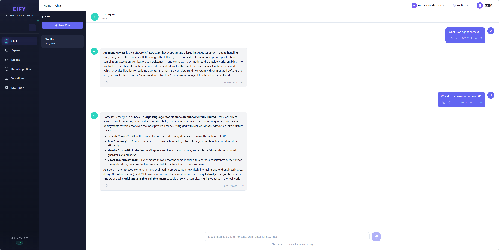
</p>

### Agent & Provider Management

<table>
  <tr>
    <td width="50%">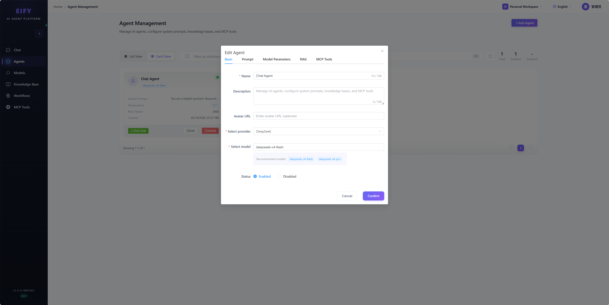</td>
    <td width="50%">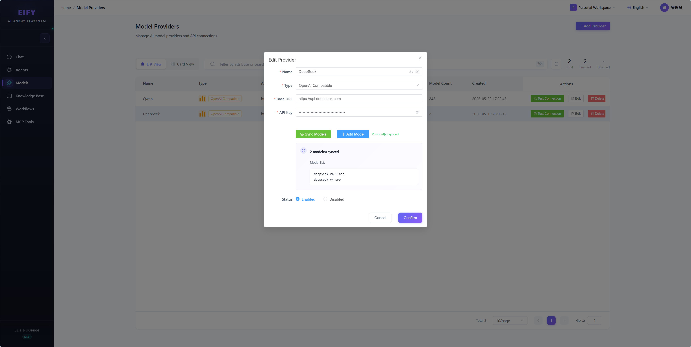</td>
  </tr>
</table>

### Knowledge Base & RAG

<table>
  <tr>
    <td width="50%">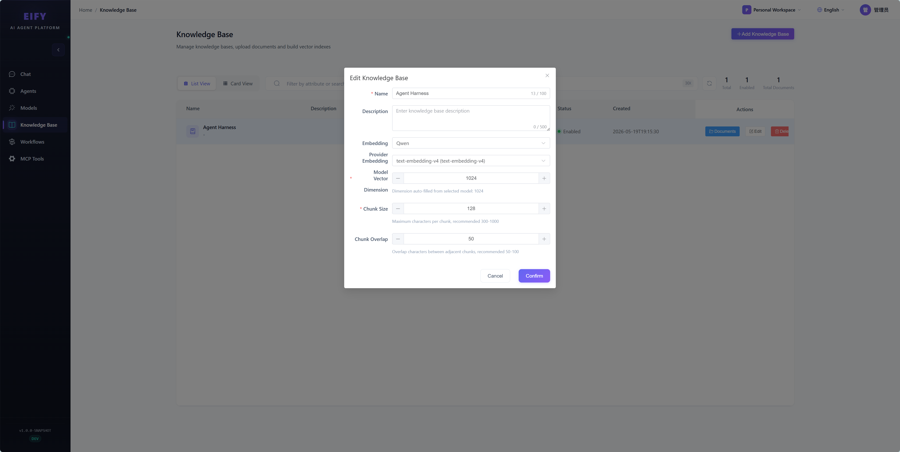</td>
    <td width="50%">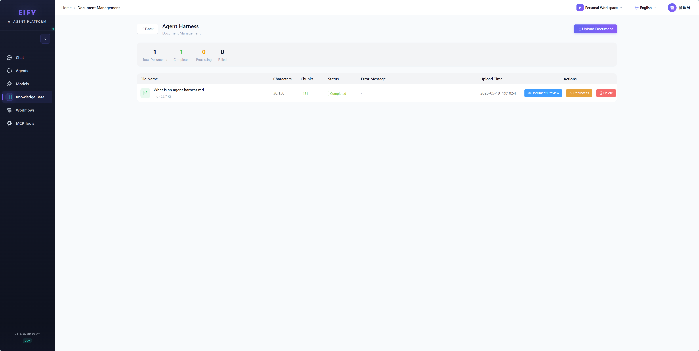</td>
  </tr>
  <tr>
    <td colspan="2">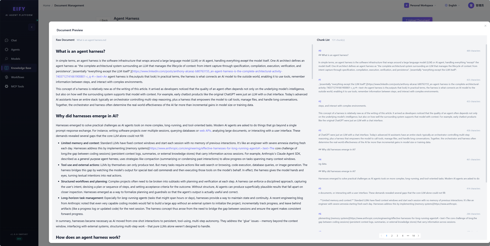</td>
  </tr>
</table>

### Visual Workflow Editor

<table>
  <tr>
    <td width="50%">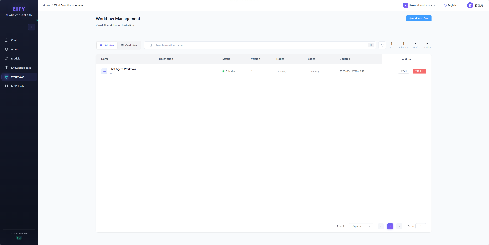</td>
    <td width="50%">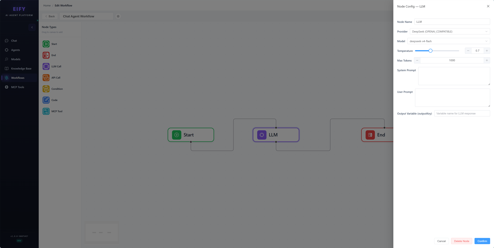</td>
  </tr>
</table>

### MCP Tools

<table>
  <tr>
    <td width="50%">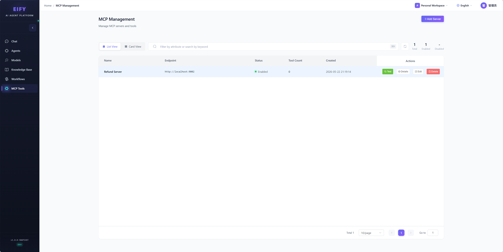</td>
    <td width="50%">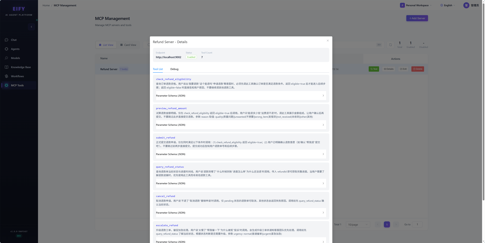</td>
  </tr>
</table>

### Multi-Tenant Workspace

<table>
  <tr>
    <td width="50%">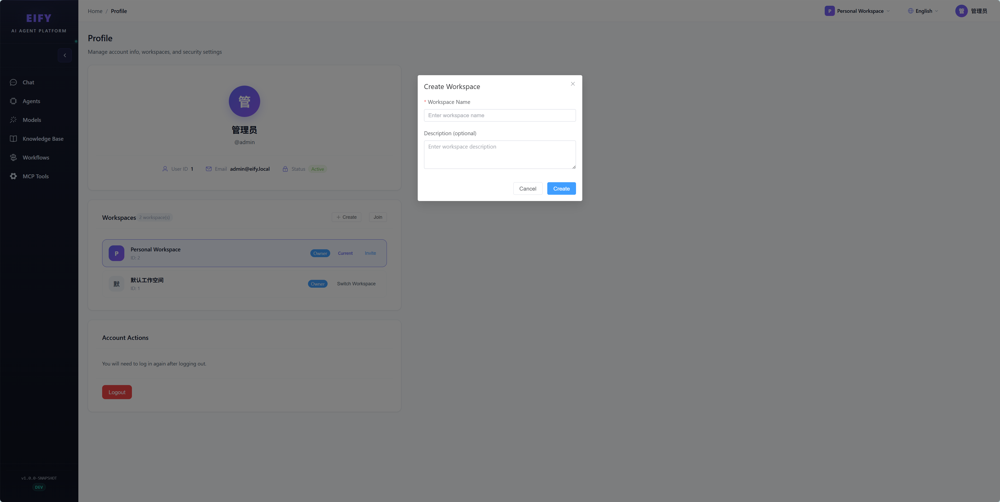</td>
    <td width="50%">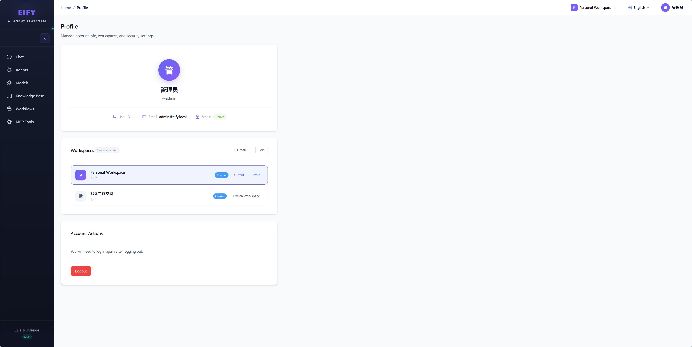</td>
  </tr>
</table>

### Authentication

<table>
  <tr>
    <td width="50%">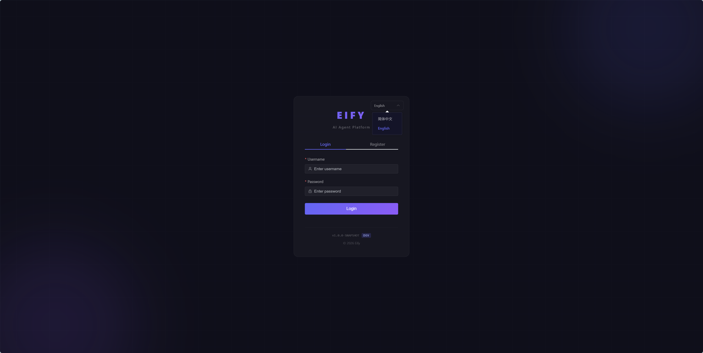</td>
    <td width="50%">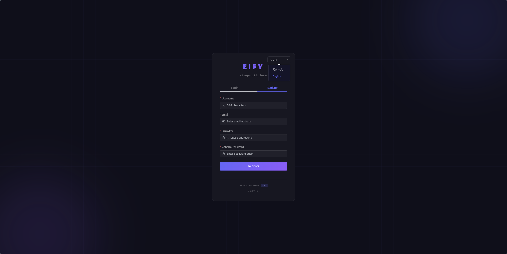</td>
  </tr>
</table>

## Quick Start

### Prerequisites

- [Docker](https://docs.docker.com/get-docker/) & Docker Compose
- JDK 21+ & Maven 3.9+ (local development only)

### Docker Deploy (Recommended)

```bash
# 1. Clone
git clone https://github.com/mikewoo/eify.git
cd eify

# 2. Configure environment
cp .env.example .env
# Edit .env — set passwords and API keys

# 3. Build backend JAR
mvn clean package -DskipTests

# 4. Start all services
docker-compose -f deploy/infra/deploy/docker-compose.yml up -d

# 5. Access
# Frontend: http://localhost
# API Docs:  http://localhost:8080/doc.html
```

### Local Development

```bash
# 1. Start dependencies (PostgreSQL + Redis)
docker-compose -f deploy/infra/deploy/docker-compose.yml up -d pgvector redis

# 2. Start backend
./start.sh dev
# Or: mvn spring-boot:run -pl eify-app -Dspring-boot.run.profiles=dev

# 3. Start frontend
cd eify-web
npm install
npm run dev

# 4. Access
# Frontend: http://localhost:5173
# API Docs:  http://localhost:8080/doc.html
```

### Optional Components

```bash
# Logging stack (ClickHouse + Vector + Grafana)
docker-compose -f deploy/infra/deploy/docker-compose-logging.yml up -d

# Distributed tracing UI (Jaeger)
docker-compose -f deploy/optional/docker-compose-jaeger.yml up -d

# Vector database (pgvector) — already included in the main compose above
```

## Tech Stack

| Layer | Technology |
|:---|:---|
| **Backend Framework** | Spring Boot 4.0.6 |
| **ORM** | MyBatis-Plus 3.5.15 |
| **Database** | PostgreSQL 17 + pgvector |
| **Cache** | Redis 7 |
| **Frontend** | Vue 3.5.17 + TypeScript + Vite |
| **UI Framework** | Element Plus 2.10.2 |
| **State Management** | Pinia 2.3.1 |
| **Workflow UI** | Vue Flow |
| **Tracing** | Micrometer Tracing + Brave |
| **Log Storage** | ClickHouse 25 + Vector 0.54 |
| **Containerization** | Docker + Docker Compose |

## Project Structure

```
eify/
├── eify-app/              # Application entry point
├── eify-auth/             # Auth & workspace (JWT, user management, multi-tenant)
├── eify-provider/         # LLM provider adapters
├── eify-agent/            # Agent creation & configuration
├── eify-chat/             # Chat engine (SSE streaming)
├── eify-knowledge/        # Knowledge base + RAG retrieval
├── eify-mcp/              # MCP tool protocol
├── eify-workflow/         # Workflow engine
├── eify-common/           # Shared utilities
├── eify-web/              # Vue 3 frontend
├── docs/                  # Project documentation (Chinese)
├── deploy/                # Deployment configs (Docker, K8s, SQL)
├── scripts/               # Utility scripts
├── start.sh               # Start script
├── stop.sh                # Stop script
└── .env.example           # Environment variable template
```

## Architecture

```
┌─────────────┐     ┌─────────────┐     ┌──────────────┐
│   Vue 3     │────▶│  Spring Boot│────▶│ PostgreSQL 17│
│   Frontend  │     │  REST API   │     │  + pgvector  │
└─────────────┘     └──────┬──────┘     └──────────────┘
                           │
               ┌───────────┼───────────┐
               │           │           │
               ▼           ▼           ▼
        ┌──────────┐ ┌──────────┐ ┌──────────┐
        │  Redis   │ │ LLM/    │ │ ClickHouse │
        │  Cache   │ │ Vector   │ │ LLM APIs │
        └──────────┘ └──────────┘ └──────────┘
```

- **Auth**: Stateless JWT + ThreadLocal context propagation
- **Multi-tenant**: All business data isolated by `workspace_id`, enforced via `WorkspaceGuard`
- **Streaming**: SSE long connections with per-token LLM push
- **Observability**: Auto-generated TraceId/SpanId via Micrometer Tracing + Brave, ClickHouse-backed logs (structured JSON)

## Documentation

> Note: Detailed docs are currently in Chinese. English translations are planned.

| Document | Description |
|:---|:---|
| [ARCHITECTURE.md](docs/ARCHITECTURE.md) | Architecture & coding conventions |
| [API-SPEC.md](docs/API-SPEC.md) | API design specification |
| [AUTH-WORKSPACE.md](docs/guides/AUTH-WORKSPACE.md) | Auth & multi-tenant workspace |
| [DATABASE.md](docs/guides/DATABASE.md) | Database design (PostgreSQL + ClickHouse) |
| [LOGGING.md](docs/guides/LOGGING.md) | Logging system guide |
| [WORKFLOW.md](docs/guides/WORKFLOW.md) | Workflow engine design |
| [DEPLOYMENT.md](docs/DEPLOYMENT.md) | Deployment & CI/CD |

## Roadmap

- [x] Ollama local model adapter
- [x] Anthropic Claude adapter
- [ ] Chat history export
- [ ] Agent template marketplace
- [x] Frontend internationalization (i18n)
- [ ] Frontend test coverage
- [ ] English documentation

## Contributing

Issues and pull requests are welcome. Before contributing, please read:

- [Contributing Guide](CONTRIBUTING.md) (Chinese)
- [Code of Conduct](CODE_OF_CONDUCT.md) (Chinese)

## License

[MIT License](LICENSE) © 2026 mikewoo

---

<p align="center">
  <sub>Made by <a href="https://github.com/mikewoo">mikewoo</a> | MIT License</sub>
</p>
